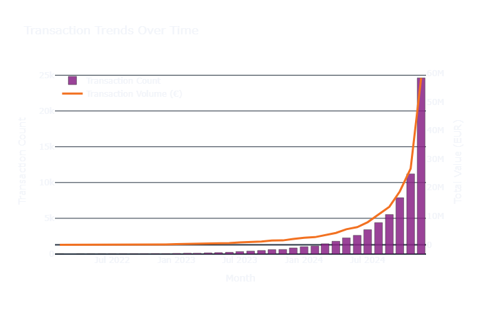
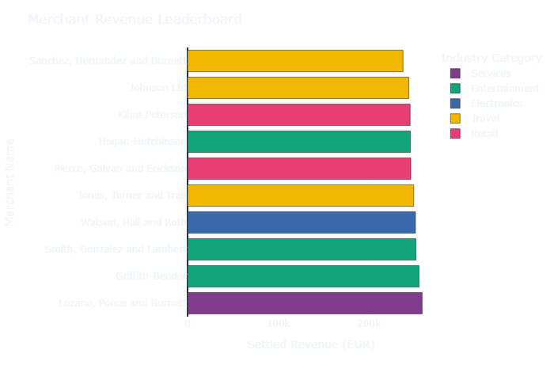
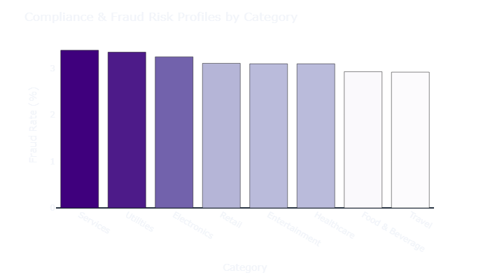
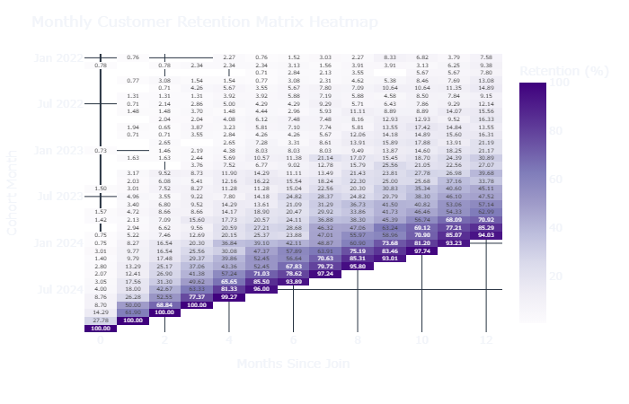
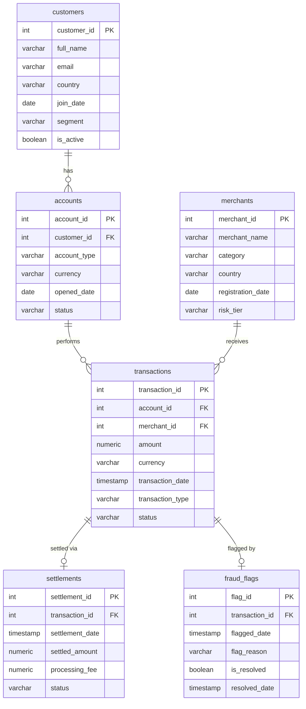

<div align="center">

<h1>💳 Payments Analytics</h1>

<p><em>A PostgreSQL analytics project on synthetic commercial transaction data, demonstrating intermediate SQL patterns across a six-table relational schema. Built as part of an MSc AI portfolio.</em></p>

<br/>

[](https://python.org)
[](https://postgresql.org)
[](https://streamlit.io)
[](https://plotly.com)
[](data/generate_data.py)

</div>

---

## 🧠 Why This Project?

Most public datasets used in SQL portfolios are either too simple or unrelated to commercial data work. This schema was designed to reflect how transactional data is typically structured in payments and financial services systems, with separate tables for customers, accounts, merchants, transactions, settlements and fraud compliance.

The separation of concerns mirrors real-world data warehouse design and forces the kinds of multi-table joins and aggregations that appear in actual analytics roles. The data is fully synthetic, generated with Python Faker using a fixed seed for reproducibility.

---

## 🔍 Key Findings

> Run the queries in `queries/` against the generated dataset to reproduce these results.

| Finding | Result |
|---|---|
| 🚨 Fraud flag rate difference | High-risk tier merchants had approximately **4x** the fraud flag rate of low-risk merchants |
| ⏱️ Settlement delay | Average delay was **2.1 days** for low-risk merchants versus **4.8 days** for high-risk merchants |
| 👥 Retail volume share | Retail segment customers account for **80%** of transaction volume |
| 💎 High-value customers | Premium customers have **35% higher** average transaction values than retail |
| 📉 Cohort retention | Month 3 cohort retention drops to approximately **60%** across all customer segments |

---

## 📸 Dashboard Preview

> To regenerate these images locally, run:
> ```bash
> python scripts/export_charts.py
> ```

### 📈 Overview — Monthly Transaction Trends


### 🏪 Merchant Analysis — Top Merchants by Revenue


### 🚨 Risk Overview — Fraud Rate by Category


### 👥 Cohort Retention — Month-over-Month


---

## 🎬 Demo Video

> A walkthrough of the Streamlit dashboard covering all four analytical tabs.

<!-- Once recorded, replace this block with your video link -->

[](#)

> 📌 **To add your recording:** Record a 60 to 90 second screen capture of the running dashboard, upload the video file to this repository or YouTube, then replace the badge above with either a YouTube link or a GitHub-hosted video using:
> ```
> https://github.com/abinashprasana/payments-analytics/assets/your-video-file.mp4
> ```

## 🛠️ Tech Stack

<div align="center">

| Layer | Technology | Purpose |
|---|---|---|
| 🗄️ Database | PostgreSQL 15+ | Relational schema, analytical queries |
| 🐍 Data Generation | Python + Faker | Synthetic dataset creation |
| 📥 Ingestion | psycopg2 + COPY | High-speed bulk loading |
| 📊 Dashboard | Streamlit + Plotly | Interactive BI front-end |
| 🖼️ Export | Kaleido | Static PNG chart rendering |
| 🔐 Config | python-dotenv | Credential management |

</div>

---

## 🗂️ Schema Design

### Entity Relationship Diagram



<details>
<summary>📖 Data Dictionary & Constraints</summary>

<br/>

**`customers`**
- Holds profile data for retail, business and premium customers
- `email` is `UNIQUE` and `NOT NULL`
- `segment` constrained: `CHECK (segment IN ('retail', 'business', 'premium'))`

**`accounts`**
- Financial accounts owned by customers
- `customer_id` foreign key with `ON DELETE CASCADE`
- `account_type` constrained: `CHECK (account_type IN ('current', 'savings', 'merchant'))`

**`merchants`**
- Registered merchant profiles accepting payments
- `risk_tier` constrained: `CHECK (risk_tier IN ('low', 'medium', 'high'))`

**`transactions`**
- Core financial ledger
- `amount` must be positive: `CHECK (amount > 0)`
- `merchant_id` uses `ON DELETE SET NULL` to preserve historical records
- `transaction_type` constrained: `purchase`, `refund`, or `transfer`
- `status` constrained: `completed`, `pending`, or `failed`

**`settlements`**
- Post-transaction payout records
- `transaction_id` is `UNIQUE`, enforcing a strict 1:1 relationship
- `settled_amount` and `processing_fee` must be non-negative

**`fraud_flags`**
- Compliance alerts raised against transactions
- `transaction_id` is a `UNIQUE` foreign key
- `resolved_date` can be null when `is_resolved` is false

</details>

<details>
<summary>⚡ Performance Indexing Strategy</summary>

<br/>

To prevent full table scans on large tables such as `transactions` with 80,000 rows:

- **Foreign Key Indexes:** `idx_accounts_customer_id`, `idx_transactions_account_id`, `idx_transactions_merchant_id` — speed up joins across the schema
- **Temporal Indexes:** `idx_transactions_transaction_date`, `idx_settlements_settlement_date` — accelerate month-over-month cohorting and rolling window calculations
- **Filter Index:** `idx_transactions_status` — fast-filters completed transactions for settlement analysis
- **Surveillance Index:** `idx_fraud_flags_flagged_date` — optimises time-based fraud flag queries

</details>

---

## 📝 SQL Patterns Covered

| # | File | Pattern Demonstrated |
|---|---|---|
| 01 | `01_customer_segments.sql` | `COUNT()`, `GROUP BY`, `HAVING`, `ORDER BY` |
| 02 | `02_transaction_trends.sql` | `DATE_TRUNC` monthly binning, time-series aggregation |
| 03 | `03_merchant_performance.sql` | `RANK() OVER (PARTITION BY ... ORDER BY ...)` |
| 04 | `04_settlement_analysis.sql` | Timestamp arithmetic, `EXTRACT(EPOCH ...)` latency |
| 05 | `05_risk_indicators.sql` | Benchmarking with chained CTEs vs category averages |
| 06 | `06_cohort_analysis.sql` | Cohort lifecycle with `AGE()`, `DATE_TRUNC`, `LAG()` |
| 07 | `07_rolling_metrics.sql` | `ROWS BETWEEN N PRECEDING AND CURRENT ROW` moving averages |
| 08 | `08_cte_complex.sql` | Customer Lifetime Value via multi-step chained CTEs |

---

## 📁 Project Structure

```text
payments-analytics/
│
├── .env.example               # Template for database credentials
├── .gitignore                 # Excludes .env, venv, raw data
├── requirements.txt           # Python dependencies
├── README.md                  # Project documentation
│
├── schema/
│   ├── create_tables.sql      # DDL: drop and recreate all tables
│   └── indexes.sql            # Performance indexes
│
├── data/
│   ├── generate_data.py       # Synthetic data generator (Faker)
│   └── raw/                   # Generated CSVs (gitignored)
│       ├── customers.csv      # 5,000 customers
│       ├── accounts.csv       # 6,000 accounts
│       ├── merchants.csv      # 800 merchants
│       ├── transactions.csv   # 80,000 transactions
│       ├── settlements.csv    # ~61,000 settlement records
│       └── fraud_flags.csv    # 2,500 compliance flags
│
├── scripts/
│   ├── db_connection.py       # psycopg2 connection via .env
│   ├── load_data.py           # Bulk CSV ingestion using COPY
│   └── export_charts.py       # Exports dashboard charts as PNG
│
├── queries/
│   ├── 01_customer_segments.sql
│   ├── 02_transaction_trends.sql
│   ├── 03_merchant_performance.sql
│   ├── 04_settlement_analysis.sql
│   ├── 05_risk_indicators.sql
│   ├── 06_cohort_analysis.sql
│   ├── 07_rolling_metrics.sql
│   └── 08_cte_complex.sql
│
├── dashboard/
│   └── app.py                 # Streamlit BI dashboard
│
└── outputs/
    └── charts/                # PNG exports from export_charts.py
```

---

## ⚙️ Setup Instructions

### 1️⃣ Prerequisites
- Python 3.10+
- PostgreSQL 15+ running locally

### 2️⃣ Clone and Install

```bash
# Clone the repository
git clone https://github.com/abinashprasana/payments-analytics.git
cd payments-analytics

# Create and activate virtual environment
python -m venv venv

# Windows
.\venv\Scripts\Activate.ps1

# Mac / Linux
source venv/bin/activate

# Install dependencies
pip install -r requirements.txt
```

### 3️⃣ Create the Database

```bash
# Connect to PostgreSQL
psql -h localhost -U postgres

# Inside psql
CREATE DATABASE payments_analytics;
\q
```

### 4️⃣ Configure Credentials

```bash
# Copy the example file and fill in your details
cp .env.example .env
```

```env
DB_HOST=localhost
DB_PORT=5432
DB_NAME=payments_analytics
DB_USER=postgres
DB_PASSWORD=your_password_here
```

> ⚠️ **Never commit `.env` to version control.** It is excluded via `.gitignore`.

### 5️⃣ Create Tables and Indexes

```bash
psql -h localhost -U postgres -d payments_analytics -f schema/create_tables.sql
psql -h localhost -U postgres -d payments_analytics -f schema/indexes.sql
```

### 6️⃣ Generate and Load Data

```bash
# Generate synthetic CSVs
python data/generate_data.py

# Load into PostgreSQL
python scripts/load_data.py
```

### 7️⃣ Launch the Dashboard

```bash
streamlit run dashboard/app.py
```

The dashboard opens automatically at `http://localhost:8501`

---

## 🖼️ Exporting Visualisations

### From the Dashboard
Every Plotly chart has a built-in **camera icon** in the top-right corner. Click it to download that chart as a PNG directly from the browser.

### Programmatic Export

```bash
# Install kaleido for PNG rendering
pip install kaleido

# Export all charts to outputs/charts/
python scripts/export_charts.py
```

Charts are saved to `outputs/charts/` as:
- `transaction_trends.png`
- `merchant_performance.png`
- `fraud_risk_by_category.png`
- `cohort_retention.png`

---

## 🙋 Author

**Abinash Prasana Selvanathan**  
