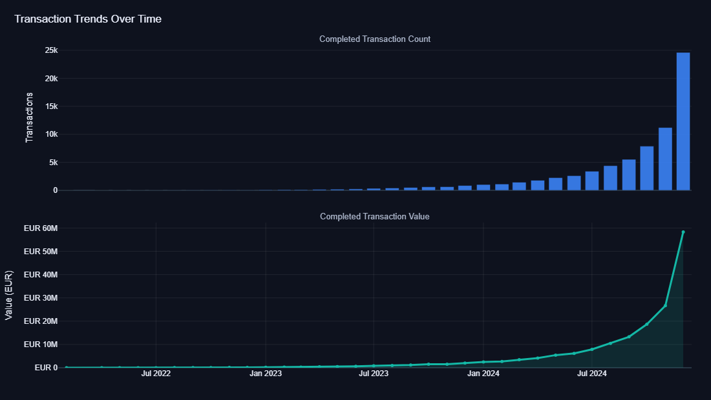
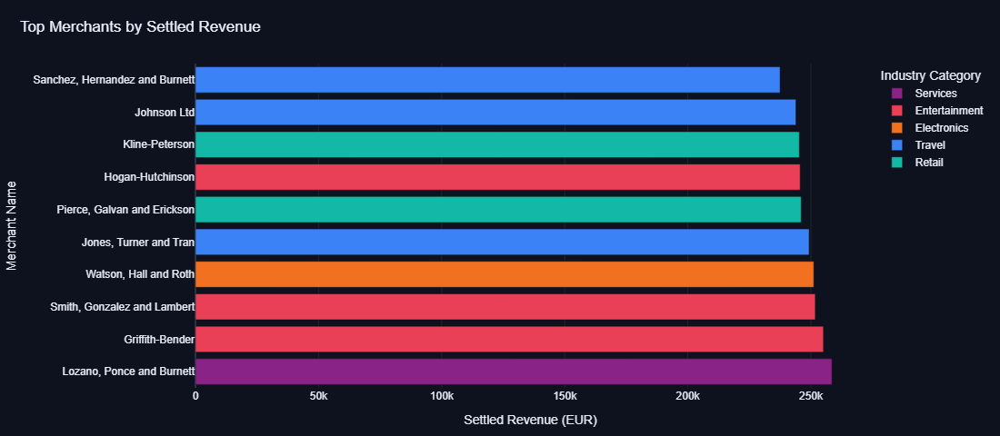
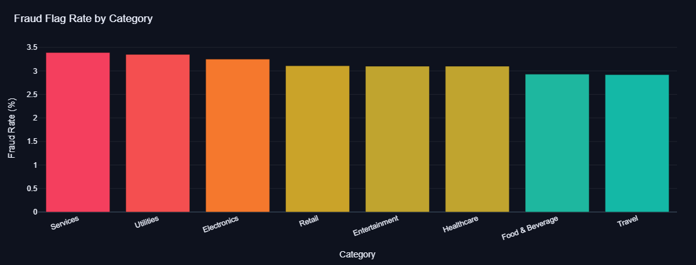
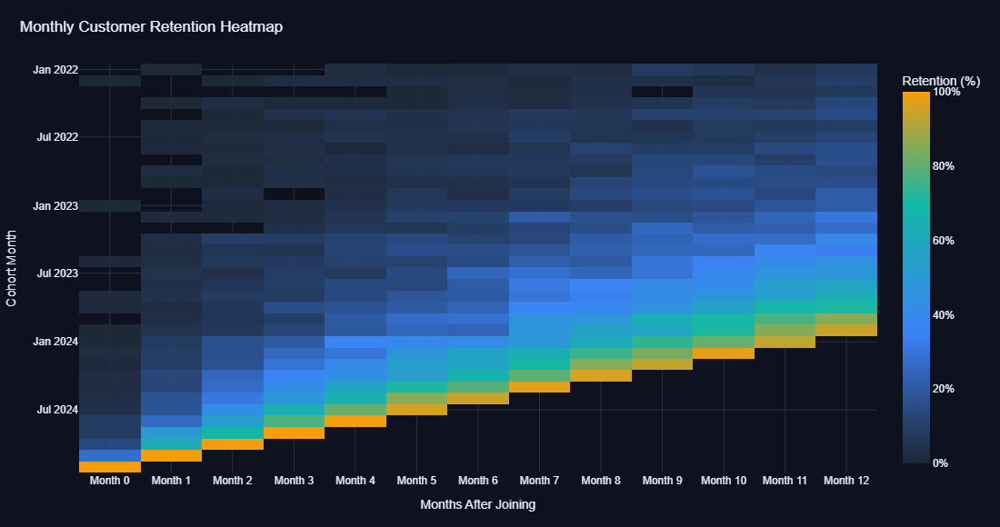
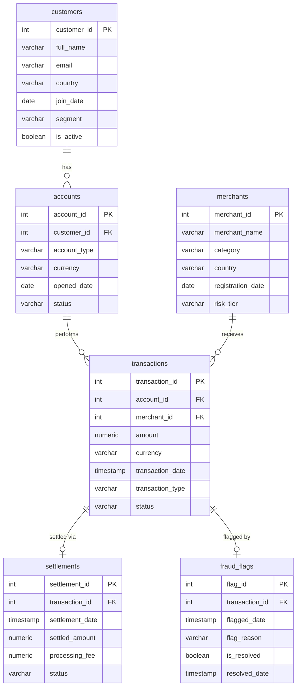

<div align="center">

# 💳 Payments Analytics

<p><em>A full-stack analytics project built around a synthetic commercial payments dataset, covering PostgreSQL schema design, Python data generation, SQL analysis, a live Streamlit dashboard, and a Power BI report.</em></p>

<br/>

[](https://python.org)
[](https://postgresql.org)
[](https://abinashprasana-payments-analytics-dashboardapp-mrsz1m.streamlit.app/)
[](https://plotly.com)
[](Power%20BI/payments_analytics_dashboard.pbix)
[](https://pandas.pydata.org)
[](.)

<br/>

### 🚀 Try the Live Dashboard

[](https://abinashprasana-payments-analytics-dashboardapp-mrsz1m.streamlit.app/)

*No login or setup required — click to open.*

</div>

---

## 🧠 What This Project Is About

This project models a commercial payments analytics system using a six-table relational database built in PostgreSQL. The goal was to go beyond a simple CSV analysis and work with data the way it actually lives in real fintech environments — spread across related tables, requiring joins, aggregations, and analytical SQL to draw anything useful out of it.

The dataset is fully synthetic, generated with Python and the Faker library, and covers three years of fictional commercial payment activity across 10 countries and 8 merchant categories. The data is analysed through a set of SQL queries covering everything from customer segmentation to fraud risk and cohort retention, then presented through two dashboard layers: an interactive Streamlit app deployed on Streamlit Cloud and a Power BI report.

Customers own accounts, accounts originate transactions, merchants receive settlements, and a separate compliance table tracks fraud flags independently — a structure that closely mirrors how production payment data is organised.

---

## 📌 Dataset Snapshot

| Metric | Value |
|---|---:|
| Customers | 5,000 |
| Accounts | 6,000 |
| Merchants | 800 |
| Transactions | 80,000 |
| Completed transactions | 71,870 |
| Settlement records | 61,124 |
| Fraud flags | 2,500 |
| Transaction date range | 2022-02-07 to 2024-12-31 |
| Completed transaction value | EUR 170,718,812.07 |
| Average completed transaction value | EUR 2,375.38 |

---

## 🔍 Key Results

| Area | Result |
|---|---|
| ✅ Completed payment activity | 71,870 transactions completed out of 80,000 total, giving a 90% completion rate. |
| 💶 Transaction value | Completed transactions total EUR 170.72M across the three-year period, with an average value of EUR 2,375.38 per transaction. |
| 👥 Customer segment activity | Retail customers generated 64,104 transactions, representing 80.13% of all transaction records across all three segments. |
| 🚨 Fraud flags by category | Services has the highest fraud flag rate at 3.39% and Travel has the lowest at 2.92%, with all categories sitting between 2.9% and 3.4%. |
| ⏱️ Settlement status | Of 61,124 settlement records, 57,381 are fully settled, 3,117 are delayed, and 626 are disputed. |
| 🧾 Settlement value | The settlement table holds EUR 141.68M in settled payouts and EUR 2.31M in processing fees collected from merchants. |

---

## ✨ Streamlit Dashboard

[](https://abinashprasana-payments-analytics-dashboardapp-mrsz1m.streamlit.app/)

The dashboard is live and publicly accessible. It loads data directly from the CSV files in this repository so no database connection is needed to view it. The layout uses a dark glass-style design with a gradient background, glass-effect metric cards, and Plotly charts styled to match throughout.

The dashboard has five tabs:

| Tab | What it shows |
|---|---|
| Overview | Three KPI cards (completed transactions, total volume, average transaction size) followed by two stacked charts: a bar chart for monthly transaction count and an area line chart for monthly transaction value |
| Merchants | Horizontal bar chart ranking the top 10 merchants by settled revenue, colour-coded by industry category, with a supporting detail table |
| Risk | Fraud flag rate bar chart using a green-to-red colour scale across merchant categories, plus a compact risk rates table |
| Retention | Plotly heatmap of the monthly customer cohort retention matrix, showing how each join-month cohort returns over their first 12 months |
| Summary | Dataset scope cards and a written explanation of what the project covers and how it was built |

### 📈 Transaction Trends



### 🏬 Merchant Performance



### 🚨 Fraud Risk by Category



### 👥 Cohort Retention



---

## 📊 Power BI Dashboard

The Power BI report is included at [`Power BI/payments_analytics_dashboard.pbix`](Power%20BI/payments_analytics_dashboard.pbix). It was built from the same six CSV files and provides a separate BI-style view of the project designed for presentation and stakeholder sharing.

| Page | Focus |
|---|---|
| 🏠 Executive Overview | KPI cards, monthly transaction trends, transaction type split, and date filters |
| 🏬 Merchant Performance | Revenue leaderboard, category breakdown, merchant detail table, and risk tier distribution |
| 🚨 Fraud and Risk | Fraud rate indicators, category risk chart, flag reason breakdown, monthly resolution trend, and unresolved flag list |
| 👥 Customer Segments | Country and segment distribution, monthly acquisition trend, active customer ratio, and geographic map |

#### 🏠 Executive Overview


#### 🏬 Merchant Performance


#### 🚨 Fraud and Risk


#### 👥 Customer Segments


---

## 🗂️ Schema Design


```mermaid
erDiagram
    customers ||--o{ accounts : "has"
    accounts ||--o{ transactions : "performs"
    merchants ||--o{ transactions : "receives"
    transactions ||--o| settlements : "settled via"
    transactions ||--o| fraud_flags : "flagged by"

    customers {
        int customer_id PK
        varchar full_name
        varchar email
        varchar country
        date join_date
        varchar segment
        boolean is_active
    }

    accounts {
        int account_id PK
        int customer_id FK
        varchar account_type
        varchar currency
        date opened_date
        varchar status
    }

    merchants {
        int merchant_id PK
        varchar merchant_name
        varchar category
        varchar country
        date registration_date
        varchar risk_tier
    }

    transactions {
        int transaction_id PK
        int account_id FK
        int merchant_id FK
        numeric amount
        varchar currency
        timestamp transaction_date
        varchar transaction_type
        varchar status
    }

    settlements {
        int settlement_id PK
        int transaction_id FK
        timestamp settlement_date
        numeric settled_amount
        numeric processing_fee
        varchar status
    }

    fraud_flags {
        int flag_id PK
        int transaction_id FK
        timestamp flagged_date
        varchar flag_reason
        boolean is_resolved
        timestamp resolved_date
    }
```

<details>
<summary>📖 Data dictionary and constraints</summary>

<br/>

**`customers`** — Customer profile data. `email` is unique and required. `segment` is constrained to `retail`, `business`, or `premium`.

**`accounts`** — Financial accounts owned by customers. Each account links to a customer via `customer_id`. `account_type` is constrained to `current`, `savings`, or `merchant`.

**`merchants`** — Merchant profiles for businesses accepting payments. `risk_tier` is constrained to `low`, `medium`, or `high`.

**`transactions`** — Main payment activity table. `amount` must be positive. `transaction_type` is constrained to `purchase`, `refund`, or `transfer`. `status` is constrained to `completed`, `pending`, or `failed`.

**`settlements`** — Settlement records for completed merchant transactions. `transaction_id` is unique, enforcing one settlement per transaction at most. Both `settled_amount` and `processing_fee` must be non-negative.

**`fraud_flags`** — Compliance flags raised against transactions. `resolved_date` can be empty when a flag has not yet been resolved.

</details>

---

## 📝 SQL Analysis Queries

Eight analytical queries cover the full scope of the dataset, from simple aggregations to window functions and multi-step CTEs.

| # | File | Focus |
|---|---|---|
| 01 | [`queries/01_customer_segments.sql`](queries/01_customer_segments.sql) | Customer count by country and segment |
| 02 | [`queries/02_transaction_trends.sql`](queries/02_transaction_trends.sql) | Monthly transaction volume and average value |
| 03 | [`queries/03_merchant_performance.sql`](queries/03_merchant_performance.sql) | Merchant revenue ranking with window functions |
| 04 | [`queries/04_settlement_analysis.sql`](queries/04_settlement_analysis.sql) | Average settlement latency by merchant category |
| 05 | [`queries/05_risk_indicators.sql`](queries/05_risk_indicators.sql) | Merchants exceeding their category fraud rate benchmark |
| 06 | [`queries/06_cohort_analysis.sql`](queries/06_cohort_analysis.sql) | Monthly customer cohort retention with LAG comparison |
| 07 | [`queries/07_rolling_metrics.sql`](queries/07_rolling_metrics.sql) | 7-day and 30-day rolling averages with day-over-day change |
| 08 | [`queries/08_cte_complex.sql`](queries/08_cte_complex.sql) | Customer lifetime value with chained CTEs |

---

## 📁 Project Structure

```text
payments-analytics/
│
├── .env.example
├── .gitignore
├── requirements.txt
├── README.md
│
├── schema/
│   ├── create_tables.sql
│   └── indexes.sql
│
├── data/
│   ├── generate_data.py
│   └── raw/
│       ├── customers.csv
│       ├── accounts.csv
│       ├── merchants.csv
│       ├── transactions.csv
│       ├── settlements.csv
│       └── fraud_flags.csv
│
├── scripts/
│   ├── db_connection.py
│   ├── load_data.py
│   └── export_charts.py
│
├── queries/
│   ├── 01_customer_segments.sql
│   └── ... (08 files total)
│
├── dashboard/
│   └── app.py
│
├── Power BI/
│   └── payments_analytics_dashboard.pbix
│
└── outputs/
    └── charts/
        ├── transaction_trends.png
        ├── merchant_performance.png
        ├── fraud_risk_by_category.png
        └── cohort_retention.png
```

---

## ⚙️ Running Locally

The live app works without any setup — just click the button at the top. If you want to run it locally with a PostgreSQL database:

**Prerequisites:** Python 3.10+, PostgreSQL 15+

```bash
# Clone and install
git clone https://github.com/abinashprasana/payments-analytics.git
cd payments-analytics
python -m venv venv

# Windows
.\venv\Scripts\Activate.ps1
# Mac / Linux
source venv/bin/activate

pip install -r requirements.txt
```

Copy `.env.example` to `.env` and fill in your PostgreSQL credentials, then:

```bash
# Set up the database
psql -U postgres -c "CREATE DATABASE payments_analytics;"
psql -U postgres -d payments_analytics -f schema/create_tables.sql
psql -U postgres -d payments_analytics -f schema/indexes.sql

# Load data and launch
python scripts/load_data.py
streamlit run dashboard/app.py
```

The app automatically detects whether PostgreSQL is available. If not, it falls back to reading the CSV files directly — the same data the live deployment uses.

---

## 🙋 Author

**Abinash Prasana Selvanathan**
