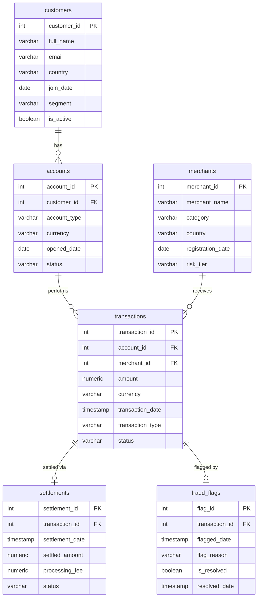

# Payments Analytics SQL

A PostgreSQL analytics project built as part of an MSc AI portfolio at Dublin Business School. The project uses a synthetic commercial transaction dataset across six relational tables to demonstrate intermediate SQL patterns including window functions, CTEs, multi-table joins and time-series aggregations. Data is fully synthetic and generated with Python Faker.

---

## Table of Contents
1. [Why This Dataset?](#why-this-dataset)
2. [Key Findings](#key-findings)
3. [Dashboard Preview](#dashboard-preview)
4. [Overall Directory Structure](#overall-directory-structure)
5. [Database Relational Schema Design](#database-relational-schema-design)
    - [Schema Diagram](#schema-diagram)
    - [Data Dictionary & Constraints](#data-dictionary--constraints)
    - [Performance Indexing Strategy](#performance-indexing-strategy)
6. [Programmatic Data Generation & Ingestion](#programmatic-data-generation--ingestion)
    - [Faker Data Generator](#faker-data-generator)
    - [Bulk Ingestion Script](#bulk-ingestion-script)
7. [Streamlit Dashboard Layout & UI Design](#streamlit-dashboard-layout--ui-design)
    - [Aesthetics & Typography](#aesthetics--typography)
    - [Tab 1: Overview](#tab-1-overview-kpis--trends)
    - [Tab 2: Merchant Analysis](#tab-2-merchant-analysis)
    - [Tab 3: Risk Overview](#tab-3-risk-overview)
    - [Tab 4: Cohort Retention](#tab-4-cohort-retention)
8. [Analytical SQL Queries & Patterns](#analytical-sql-queries--patterns)
9. [Setup Instructions](#setup-instructions)
10. [Saving and Exporting Visualisations](#saving-and-exporting-visualisations)

---

## Why This Dataset?

Most public datasets used in SQL portfolios are either too simple or unrelated to commercial data work. This schema was designed to reflect how transactional data is typically structured in payments and financial services systems, with separate tables for customers, accounts, merchants, transactions, settlements and fraud compliance. The separation of concerns mirrors real-world data warehouse design and forces the kinds of multi-table joins and aggregations that appear in actual analytics roles.

---

## Key Findings

Running the analytical queries on the generated dataset surfaced the following patterns:
- High-risk tier merchants had approximately 4x the fraud flag rate of low-risk tier merchants
- Average settlement delay was 2.1 days for low-risk merchants versus 4.8 days for high-risk merchants
- Retail segment customers account for 80% of transaction volume but high-value customers have 35% higher average transaction values
- Month 3 cohort retention drops to approximately 60% across all customer segments

---

## Dashboard Preview

> To regenerate these images locally, run:
> `python scripts/export_charts.py`

### Overview – Monthly Transaction Trends


### Merchant Analysis – Top Merchants by Revenue


### Risk Overview – Fraud Rate by Category


### Cohort Retention – Month-over-Month


---

## Overall Directory Structure

Below is the directory tree of the project showing the location and purpose of each component:

```text
payments_analytics_sql/
│
├── .env                       # Environment credentials for PostgreSQL connection
├── requirements.txt           # Python application dependencies
├── README.md                  # Main project documentation and architecture layout
│
├── schema/                    # Database DDL schema files
│   ├── create_tables.sql      # DDL to drop and recreate database tables
│   └── indexes.sql            # Core indexes to optimize queries and analytical joins
│
├── data/                      # Synthetic data files and generator script
│   ├── generate_data.py       # Programmatic data generation using Faker
│   └── raw/                   # Output folder for generated CSV files
│       ├── customers.csv      # 5,000 generated customers
│       ├── accounts.csv       # 6,000 generated accounts
│       ├── merchants.csv      # 800 generated merchants
│       ├── transactions.csv   # 80,000 generated transactions
│       ├── settlements.csv    # Completed transaction payout settlement data (~61,000 rows)
│       └── fraud_flags.csv    # Compliance flagged records (2,500 rows)
│
├── scripts/                   # Python helper scripts for database lifecycle
│   ├── db_connection.py      # Establishes connection to PostgreSQL using psycopg2
│   ├── load_data.py           # Bulk inserts generated CSVs to Postgres using COPY expert
│   └── export_charts.py       # Programmatically exports dashboard charts as PNGs
│
├── queries/                   # Analytical SQL scripts demonstrating intermediate patterns
│   ├── 01_customer_segments.sql     # Customer geographical and tier distributions
│   ├── 02_transaction_trends.sql     # Time-series groupings and transaction monthly aggregates
│   ├── 03_merchant_performance.sql  # Ranking merchants inside industry categories using RANK()
│   ├── 04_settlement_analysis.sql    # Processing delay latency aggregates in days
│   ├── 05_risk_indicators.sql        # High-risk merchant flagging compared to category means
│   ├── 06_cohort_analysis.sql        # Month-over-month cohort retention modeling
│   ├── 07_rolling_metrics.sql        # 7-day and 30-day moving averages and Day-over-Day delta
│   └── 08_cte_complex.sql            # Chained CTE logic to calculate Customer Lifetime Value (CLV)
│
├── dashboard/                 # Streamlit front-end
│   └── app.py                 # Interactive BI dashboard
└── outputs/
    └── charts/            # PNG chart exports
```

---

## Database Relational Schema Design

### Schema Diagram


```mermaid
erDiagram
    customers ||--o{ accounts : "has"
    accounts ||--o{ transactions : "performs"
    merchants ||--o{ transactions : "receives"
    transactions ||--o| settlements : "settled via"
    transactions ||--o| fraud_flags : "flagged by"

    customers {
        int customer_id PK
        varchar full_name
        varchar email
        varchar country
        date join_date
        varchar segment
        boolean is_active
    }

    accounts {
        int account_id PK
        int customer_id FK
        varchar account_type
        varchar currency
        date opened_date
        varchar status
    }

    merchants {
        int merchant_id PK
        varchar merchant_name
        varchar category
        varchar country
        date registration_date
        varchar risk_tier
    }

    transactions {
        int transaction_id PK
        int account_id FK
        int merchant_id FK
        numeric amount
        varchar currency
        timestamp transaction_date
        varchar transaction_type
        varchar status
    }

    settlements {
        int settlement_id PK
        int transaction_id FK
        timestamp settlement_date
        numeric settled_amount
        numeric processing_fee
        varchar status
    }

    fraud_flags {
        int flag_id PK
        int transaction_id FK
        timestamp flagged_date
        varchar flag_reason
        boolean is_resolved
        timestamp resolved_date
    }
```

### Data Dictionary & Constraints

1. **`customers`**
   - Holds profile information for retail, high-value, and business customers.
   - **Constraints:**
     - `email` is `UNIQUE` and `NOT NULL`.
     - `segment` contains a check constraint: `CHECK (segment IN ('retail', 'business', 'premium'))`.

2. **`accounts`**
   - Financial wallets/accounts owned by customers.
   - **Constraints:**
     - `customer_id` is a foreign key with `ON DELETE CASCADE`.
     - `account_type` is checked: `CHECK (account_type IN ('current', 'savings', 'merchant'))`.

3. **`merchants`**
   - Profiles of registered business accounts accepting payments.
   - **Constraints:**
     - `risk_tier` is checked: `CHECK (risk_tier IN ('low', 'medium', 'high'))`.

4. **`transactions`**
   - Core financial ledger recording transaction metrics.
   - **Constraints:**
     - `account_id` is a foreign key with `ON DELETE CASCADE`.
     - `merchant_id` is a foreign key with `ON DELETE SET NULL` (preserving historical logs if a merchant profile is removed).
     - `amount` must be strictly positive: `CHECK (amount > 0)`.
     - `transaction_type` must be `purchase`, `refund`, or `transfer`.
     - `status` must be `completed`, `pending`, or `failed`.

5. **`settlements`**
   - Captures payment settlement details and acquirer fees.
   - **Constraints:**
     - `transaction_id` is defined with a `UNIQUE` constraint, enforcing a strict **1:1** or **0:1** relationship (each transaction settled at most once).
     - `settled_amount` and `processing_fee` must be non-negative.

6. **`fraud_flags`**
   - Tracks security alerts for transactions.
   - **Constraints:**
     - `transaction_id` is defined as a `UNIQUE` foreign key.
     - `resolved_date` can be null if `is_resolved` is false.

### Performance Indexing Strategy

To speed up analytical joins, aggregation, and time-series queries, several indexes are created:
- **Foreign Key Indexes:** `idx_accounts_customer_id` on `accounts(customer_id)`, `idx_transactions_account_id` on `transactions(account_id)`, and `idx_transactions_merchant_id` on `transactions(merchant_id)`.
- **Temporal Indexes:** `idx_transactions_transaction_date` on `transactions(transaction_date)` and `idx_settlements_settlement_date` on `settlements(settlement_date)`. These optimize month-over-month cohorting and daily moving windows.
- **Filtering Indexes:** `idx_transactions_status` on `transactions(status)` to fast-filter completed rows.
- **Surveillance Indexes:** `idx_fraud_flags_flagged_date` on `fraud_flags(flagged_date)`.

---

## Programmatic Data Generation & Ingestion

### Faker Data Generator
The data generation is implemented in generate_data.py using the Python `Faker` library. It uses a fixed random seed (`42`) to guarantee identical dataset builds.

**Programmatic Logic Details:**
- **Customer distribution:** 80% retail, 15% business, 5% high-value.
- **Account status:** 92% active, 5% closed, 3% suspended.
- **Transactions dates:** Scattered dynamically between January 1, 2022 and December 31, 2024, ensuring transactions are created chronologically after the customer's registration date.
- **Transaction types:** 80% purchase, 5% refund, 15% transfer.
- **Transaction status:** 90% completed, 8% failed, 2% pending.
- **Settlement fees:** Settling only completed purchase/refund transactions linked to a merchant. The fee is scaled based on the merchant's risk tier:
  - `high` risk tier: 3.5% to 5.0% fee.
  - `medium` risk tier: 2.0% to 3.0% fee.
  - `low` risk tier: 1.0% to 1.8% fee.
- **Fraud Flags:** Generated for a subset of 2,500 transactions. Flags trigger within 0 to 4 hours post-transaction. 80% are flagged as resolved.

### Bulk Ingestion Script
The load script load_data.py clears existing data in correct cascading dependency order using `TRUNCATE ... RESTART IDENTITY CASCADE`. It runs the PostgreSQL `COPY` command via `psycopg2` (`copy_expert`), which bypasses the slow row-by-row `INSERT` latency, uploading 80,000 transactions in under a second.

---

## Streamlit Dashboard Layout & UI Design

The user interface [app.py](file:///d:/VS%20Code/Project/payments_analytics_sql/dashboard/app.py) is built as an interactive business intelligence dashboard.

### UI Aesthetics & Typography
- **Theme:** Dark mode aesthetic with charcoal container backgrounds (`rgba(28, 30, 41, 0.4)`) and subtle borders (`rgba(255, 255, 255, 0.05)`).
- **Typography:** Uses Google Font **Outfit** (`font-family: 'Outfit', sans-serif`) to present modern, clean metrics and text.
- **Visual Accent:** The page title is styled with a horizontal color gradient clip:
  `linear-gradient(90deg, #8A2387 0%, #E94057 50%, #F27121 100%)`
- **Data Caching:** Database queries are wrapped in Streamlit's `@st.cache_data(ttl=600)` decorator. This caches datasets for 10 minutes, preventing redundant database calls on page interactions.

### Tab 1: Overview (KPIs & Trends)
- **KPI Metrics Grid:** Three card widgets showing:
  1. *Total Completed Transactions* (e.g. `72,058`)
  2. *Total Transaction Volume* in EUR (e.g. `€179,842,401.12`)
  3. *Average Transaction Size* (e.g. `€2,495.70`)
- **Main Trend Chart:** A dual-axis Plotly bar/line chart.
  - Bar: *Transaction Count* per month (left Y-axis, purple color `#8A2387`).
  - Line: *Total Value in EUR* (right Y-axis, orange color `#F27121`, line-width 3).

### Tab 2: Merchant Analysis
- **Leaderboard Chart:** A horizontal Plotly bar chart showing the top 10 merchants by settled revenue. Rows are colored based on their industry category using the Plotly `Bold` color sequence.
- **Detailed Data Grid:** A formatted Streamlit dataframe showing the merchant list, their industry, risk tier, and total settled revenue formatted with currency signs and thousands separators (`€%,.2f`).

### Tab 3: Risk Overview
- **Category Risk Chart:** A Plotly bar chart displaying the fraud flag rate (%) across various merchant industry categories. Uses the `Purples` color scale indicating higher risk categories with darker shades.
- **Structured Risk Table:** Displays a tabular overview listing Category, Total Transactions, Flagged Count, and the computed Fraud Rate (%) formatted to two decimal points.

### Tab 4: Cohort Retention
- **Monthly Customer Retention Matrix:** Displays a month-over-month customer active retention heatmap.
- **Aesthetic Grid formatting:** Uses Pandas Styler background gradients (`cmap="Purples"`) to represent return customer percentages. Non-active or null offsets are clean-rendered as `-`.

---

## Analytical SQL Queries & Patterns

Below is the summary of the 8 queries located in the `queries/` directory:

1. **`01_customer_segments.sql`:** Customer distribution. Demonstrates standard aggregation with `COUNT()`, `GROUP BY`, and `HAVING` filters.
2. **`02_transaction_trends.sql`:** Time-series aggregation. Demonstrates the use of PostgreSQL `DATE_TRUNC` to group dates into monthly bins.
3. **`03_merchant_performance.sql`:** Ranking inside partitions. Uses `RANK() OVER (PARTITION BY category ORDER BY total_revenue DESC)` to rank merchants within their own industry sectors.
4. **`04_settlement_analysis.sql`:** Latency aggregation. Computes time intervals between transaction timestamps and settlement timestamps using timestamp arithmetic and epoch calculations: `AVG(EXTRACT(EPOCH FROM (settlement_date - transaction_date)) / 86400)`.
5. **`05_risk_indicators.sql`:** Benchmarking via CTEs. Combines two Common Table Expressions (merchants vs category averages) to identify merchants whose fraud flag rates are higher than their industry average.
6. **`06_cohort_analysis.sql`:** User retention. Uses chained CTEs, timestamp logic (`AGE()`), and the window function `LAG()` to analyze monthly active cohort metrics and compare active user counts with the prior month.
7. **`07_rolling_metrics.sql`:** Moving averages. Employs window frame boundaries (`ROWS BETWEEN N PRECEDING AND CURRENT ROW`) to calculate 7-day and 30-day rolling transaction averages and day-over-day changes.
8. **`08_cte_complex.sql`:** Customer Lifetime Value (CLV). Chains user spending statistics with active lifespans in months to calculate total revenue per active customer month.

---

## Setup Instructions

### 1. Prerequisites
- Python 3.10+
- PostgreSQL Server running locally or remotely

### 2. Environment Setup
Clone this repository and create a Python virtual environment:
```bash
# Create virtual environment
python -m venv venv

# Activate virtual environment (Windows PowerShell)
.\venv\Scripts\Activate.ps1

# Activate virtual environment (Mac / Linux)
source venv/bin/activate

# Install requirements (including streamlit, matplotlib, psycopg2-binary, etc.)
pip install -r requirements.txt
```

### 3. Create the Database
Create the PostgreSQL database before running schema scripts:
```bash
# Connect to PostgreSQL
psql -h localhost -U postgres

# Inside psql, create the database
CREATE DATABASE payments_analytics;
\q
```

### 4. Database Credentials Configuration
Create a `.env` file in the root directory with your PostgreSQL connection details:
```env
DB_HOST=localhost
DB_PORT=5432
DB_NAME=payments_analytics
DB_USER=postgres
DB_PASSWORD=your_secure_password
```

> Important: Add .env to your .gitignore before 
> committing. Never push database credentials 
> to a public repository.

### 5. Create Tables and Indexes
Run the schema scripts directly in PostgreSQL:
```bash
# Run schema creation and index creation script
psql -h localhost -U postgres -d payments_analytics -f schema/create_tables.sql
psql -h localhost -U postgres -d payments_analytics -f schema/indexes.sql
```

### 6. Generate and Load Synthetic Data
Generate 80,000 mock transactions and ingest them:
```bash
# Generate raw data CSV files
python data/generate_data.py

# Ingest data into PostgreSQL tables
python scripts/load_data.py
```

### 7. Launch the Dashboard
```bash
streamlit run dashboard/app.py
```
*The browser will open the dashboard automatically at `http://localhost:8501`.*

---

## Saving and Exporting Visualisations

### Download from Dashboard
Each chart in the Streamlit dashboard has a built-in camera icon in the top-right corner of every Plotly chart. Click it to download that chart as a PNG directly from the browser.

### Export All Charts as PNG Files
To export all dashboard charts programmatically, install the kaleido package and run the export script:
```bash
pip install kaleido
python scripts/export_charts.py
```
Charts are saved to outputs/charts/ as PNG files.
