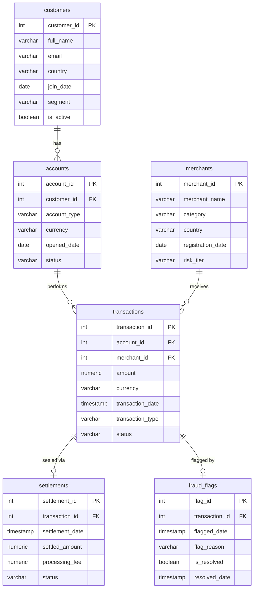

<div align="center">

# 💳 Payments Analytics

<p><em>A full-stack analytics project built around a synthetic commercial payments dataset, covering PostgreSQL schema design, Python data generation, SQL analysis, a live Streamlit dashboard, and a Power BI report.</em></p>

<br/>

[](https://python.org)
[](https://postgresql.org)
[](https://streamlit.io)
[](https://plotly.com)
[](Power%20BI/payments_analytics_dashboard.pbix)
[](https://pandas.pydata.org)
[](https://faker.readthedocs.io)
[](.)

</div>

---

## 🧠 What This Project Is About

I built this project to practice the kind of data analysis that shows up in real payments and fintech environments. The idea was to create something that goes beyond a simple CSV analysis and actually models how transactional data lives across multiple related tables in a production-style database.

The dataset is fully synthetic, generated with Python and the Faker library, and covers three years of fictional commercial payment activity across 10 countries and 8 merchant categories. From there, the data gets loaded into PostgreSQL, analysed through a set of SQL queries covering everything from customer segmentation to fraud risk, and then presented through two separate dashboard layers: an interactive Streamlit app and a Power BI report.

The structure is intentionally close to how real payment data looks in practice. Nothing is kept in a single flat file. Customers own accounts, accounts originate transactions, merchants receive settlements, and a separate compliance table tracks fraud flags independently.

---

## 📌 Dataset Snapshot

These values are calculated from the generated CSV files in `data/raw/` and verified against the source data.

| Metric | Value |
|---|---:|
| Customers | 5,000 |
| Accounts | 6,000 |
| Merchants | 800 |
| Transactions | 80,000 |
| Completed transactions | 71,870 |
| Settlement records | 61,124 |
| Fraud flags | 2,500 |
| Transaction date range | 2022-02-07 to 2024-12-31 |
| Completed transaction value | EUR 170,718,812.07 |
| Average completed transaction value | EUR 2,375.38 |

---

## 🔍 Key Results

| Area | Result |
|---|---|
| ✅ Completed payment activity | 71,870 transactions completed out of 80,000 total, giving a 90% completion rate. |
| 💶 Transaction value | Completed transactions total EUR 170.72M across the three-year period, with an average value of EUR 2,375.38 per transaction. |
| 👥 Customer segment activity | Retail customers generated 64,104 transactions, representing 80.13% of all transaction records across all three segments. |
| 🚨 Fraud flags by category | Services has the highest fraud flag rate at 3.39% and Travel has the lowest at 2.92%, with all categories sitting between 2.9% and 3.4%. |
| ⏱️ Settlement status | Of 61,124 settlement records, 57,381 are fully settled, 3,117 are delayed, and 626 are disputed. |
| 🧾 Settlement value | The settlement table holds EUR 141.68M in settled payouts and EUR 2.31M in processing fees collected from merchants. |

---

## ✨ Streamlit Dashboard

The Streamlit dashboard lives in [`dashboard/app.py`](dashboard/app.py) and connects directly to the PostgreSQL database to serve live query results.

The layout uses a dark glass-style design with a gradient background, glass-effect metric cards, and Plotly charts styled to match throughout. At the top of every page there is a row of four scope cards showing the total customer count, merchant count, transaction date window, and fraud flag count pulled live from the database.

The dashboard has five tabs:

| Tab | What it shows |
|---|---|
| Overview | Three KPI cards (completed transactions, total volume, average transaction size) followed by two separate stacked charts: a bar chart for monthly transaction count and an area line chart for monthly transaction value |
| Merchants | Horizontal bar chart ranking the top 10 merchants by settled revenue, colour-coded by industry category, with a supporting detail table below |
| Risk | Fraud flag rate bar chart using a green-to-red colour scale across merchant categories, with an insight note naming the highest-risk category, plus a compact risk rates table alongside |
| Retention | Plotly heatmap of the monthly customer cohort retention matrix, showing the percentage of each join-month cohort returning for completed transactions across their first 12 months |
| Summary | Scope cards repeating the dataset totals, followed by a written explanation of what the project is, how it was built, and what techniques it covers |

To run the dashboard locally:

```bash
streamlit run dashboard/app.py
```

The app opens in your browser at:

```text
http://localhost:8501
```

---

## 📸 Chart Exports

Static chart exports are stored in `outputs/charts/`. The export script at [`scripts/export_charts.py`](scripts/export_charts.py) connects to the database and generates PNGs that match the current dashboard design: dark background, blue bar chart and teal area line chart for transaction trends, category-coloured horizontal bars for merchants, a green-to-red gradient for the fraud rate chart, and a Plotly heatmap for cohort retention.

To regenerate the exports after the database is loaded:

```bash
python scripts/export_charts.py
```

### 📈 Transaction Trends

Two stacked panels showing monthly completed transaction count (bar) and total value (area line).


### 🏬 Merchant Performance

Top 10 merchants by settled revenue, coloured by industry category.


### 🚨 Fraud Risk by Category

Fraud flag rate per merchant category, coloured from low (green) to high (red).


### 👥 Cohort Retention

Monthly customer retention heatmap. Each row is a join-month cohort, each column is months since joining.


---

## 📊 Power BI Dashboard

The Power BI report is included at [`Power BI/payments_analytics_dashboard.pbix`](Power%20BI/payments_analytics_dashboard.pbix).

It was built from the same six CSV files and provides a separate business intelligence view of the project, covering the same analytical themes as the Streamlit dashboard but in a layout designed for presentation and stakeholder sharing.

| Page | Focus |
|---|---|
| 🏠 Executive Overview | KPI cards, monthly transaction trends, transaction type split, and date filters |
| 🏬 Merchant Performance | Revenue leaderboard, category breakdown, merchant detail table, and risk tier distribution |
| 🚨 Fraud and Risk | Fraud rate indicators, category risk chart, flag reason breakdown, monthly resolution trend, and unresolved flag list |
| 👥 Customer Segments | Country and segment distribution, monthly acquisition trend, active customer ratio, and geographic map |

### Dashboard screenshots

#### 🏠 Executive Overview


#### 🏬 Merchant Performance


#### 🚨 Fraud and Risk


#### 👥 Customer Segments


---

## 🗂️ Schema Design


```mermaid
erDiagram
    customers ||--o{ accounts : "has"
    accounts ||--o{ transactions : "performs"
    merchants ||--o{ transactions : "receives"
    transactions ||--o| settlements : "settled via"
    transactions ||--o| fraud_flags : "flagged by"

    customers {
        int customer_id PK
        varchar full_name
        varchar email
        varchar country
        date join_date
        varchar segment
        boolean is_active
    }

    accounts {
        int account_id PK
        int customer_id FK
        varchar account_type
        varchar currency
        date opened_date
        varchar status
    }

    merchants {
        int merchant_id PK
        varchar merchant_name
        varchar category
        varchar country
        date registration_date
        varchar risk_tier
    }

    transactions {
        int transaction_id PK
        int account_id FK
        int merchant_id FK
        numeric amount
        varchar currency
        timestamp transaction_date
        varchar transaction_type
        varchar status
    }

    settlements {
        int settlement_id PK
        int transaction_id FK
        timestamp settlement_date
        numeric settled_amount
        numeric processing_fee
        varchar status
    }

    fraud_flags {
        int flag_id PK
        int transaction_id FK
        timestamp flagged_date
        varchar flag_reason
        boolean is_resolved
        timestamp resolved_date
    }
```

<details>
<summary>📖 Data dictionary and constraints</summary>

<br/>

**`customers`**

Holds customer profile data. The `email` column is unique and required. The `segment` column is constrained to `retail`, `business`, or `premium`.

**`accounts`**

Stores financial accounts owned by customers. Each account links back to a customer via `customer_id`. The `account_type` column is constrained to `current`, `savings`, or `merchant`.

**`merchants`**

Stores merchant profiles for businesses accepting payments. The `risk_tier` column is constrained to `low`, `medium`, or `high`.

**`transactions`**

The main payment activity table. The `amount` column must be positive. The `transaction_type` column is constrained to `purchase`, `refund`, or `transfer`. The `status` column is constrained to `completed`, `pending`, or `failed`.

**`settlements`**

Stores settlement records for completed merchant transactions. The `transaction_id` column is unique, enforcing one settlement record per transaction at most. Both `settled_amount` and `processing_fee` must be non-negative.

**`fraud_flags`**

Stores compliance flags raised against transactions. The `resolved_date` column can be empty when a flag has not yet been resolved.

</details>

<details>
<summary>⚡ Indexing approach</summary>

<br/>

The schema includes performance indexes targeting the most common analytics access patterns:

Foreign key joins between customers, accounts, merchants, and transactions are indexed to keep multi-table aggregation fast. Transaction and settlement dates are indexed for time-series groupings and rolling window queries. The transaction status column is indexed to speed up the completed-only filters used across most queries. Fraud flag dates are indexed to support time-based compliance analysis.

</details>

---

## 📝 SQL Analysis Queries

Eight analytical queries cover the full scope of the dataset, from simple aggregations to window functions and multi-step CTEs.

| # | File | Focus |
|---|---|---|
| 01 | [`queries/01_customer_segments.sql`](queries/01_customer_segments.sql) | Customer count by country and segment |
| 02 | [`queries/02_transaction_trends.sql`](queries/02_transaction_trends.sql) | Monthly transaction volume and average value |
| 03 | [`queries/03_merchant_performance.sql`](queries/03_merchant_performance.sql) | Merchant revenue ranking with window functions |
| 04 | [`queries/04_settlement_analysis.sql`](queries/04_settlement_analysis.sql) | Average settlement latency by merchant category |
| 05 | [`queries/05_risk_indicators.sql`](queries/05_risk_indicators.sql) | Merchants exceeding their category fraud rate benchmark |
| 06 | [`queries/06_cohort_analysis.sql`](queries/06_cohort_analysis.sql) | Monthly customer cohort retention with LAG comparison |
| 07 | [`queries/07_rolling_metrics.sql`](queries/07_rolling_metrics.sql) | 7-day and 30-day rolling averages with day-over-day change |
| 08 | [`queries/08_cte_complex.sql`](queries/08_cte_complex.sql) | Customer lifetime value with chained CTEs |

---

## 📁 Project Structure

```text
payments-analytics/
│
├── .env.example
├── .gitignore
├── requirements.txt
├── README.md
│
├── schema/
│   ├── create_tables.sql
│   └── indexes.sql
│
├── data/
│   ├── generate_data.py
│   └── raw/
│       ├── customers.csv
│       ├── accounts.csv
│       ├── merchants.csv
│       ├── transactions.csv
│       ├── settlements.csv
│       └── fraud_flags.csv
│
├── scripts/
│   ├── db_connection.py
│   ├── load_data.py
│   └── export_charts.py
│
├── queries/
│   ├── 01_customer_segments.sql
│   ├── 02_transaction_trends.sql
│   ├── 03_merchant_performance.sql
│   ├── 04_settlement_analysis.sql
│   ├── 05_risk_indicators.sql
│   ├── 06_cohort_analysis.sql
│   ├── 07_rolling_metrics.sql
│   └── 08_cte_complex.sql
│
├── dashboard/
│   └── app.py
│
├── Power BI/
│   ├── payments_analytics_dashboard.pbix
│   ├── executive_overview.png
│   ├── merchant_performance.png
│   ├── fraud_risk.png
│   └── customer_segments.png
│
└── outputs/
    └── charts/
        ├── transaction_trends.png
        ├── merchant_performance.png
        ├── fraud_risk_by_category.png
        └── cohort_retention.png
```

---

## ⚙️ Setup Instructions

### 1. Prerequisites

Python 3.10 or later, PostgreSQL 15 or later, and Power BI Desktop if you want to open the `.pbix` report.

### 2. Clone and set up the environment

```bash
git clone https://github.com/abinashprasana/payments-analytics.git
cd payments-analytics
python -m venv venv
```

Activate the virtual environment on Windows:

```powershell
.\venv\Scripts\Activate.ps1
```

Or on Mac and Linux:

```bash
source venv/bin/activate
```

Install dependencies:

```bash
pip install -r requirements.txt
```

### 3. Create the database

```bash
psql -h localhost -U postgres
```

Inside the `psql` shell:

```sql
CREATE DATABASE payments_analytics;
\q
```

### 4. Configure credentials

Copy `.env.example` to `.env` and fill in your PostgreSQL connection details:

```env
DB_HOST=localhost
DB_PORT=5432
DB_NAME=payments_analytics
DB_USER=postgres
DB_PASSWORD=your_password_here
```

### 5. Create tables and indexes

```bash
psql -h localhost -U postgres -d payments_analytics -f schema/create_tables.sql
psql -h localhost -U postgres -d payments_analytics -f schema/indexes.sql
```

### 6. Generate and load data

```bash
python data/generate_data.py
python scripts/load_data.py
```

### 7. Launch Streamlit

```bash
streamlit run dashboard/app.py
```

---

## 🖼️ Exporting Visuals

Every chart in the Streamlit dashboard can be downloaded directly from the browser using the Plotly toolbar that appears on hover. To export all four charts programmatically as PNG files, run the export script instead:

```bash
python scripts/export_charts.py
```

Generated images are saved to `outputs/charts/`.

---

## 🙋 Author

**Abinash Prasana Selvanathan**
