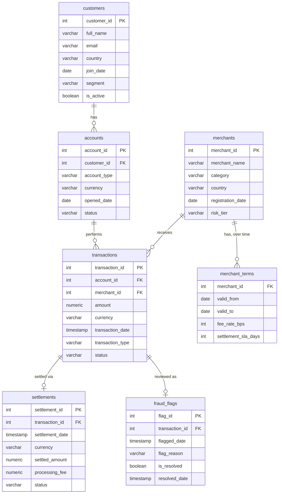

<div align="center">

# The Settlement Gap

*A SQL reconciliation investigation, built on a synthetic payments dataset, that hands off to a live operational workbench doing the same tracing in real time.*

<br/>

[](https://python.org)
[](https://postgresql.org)
[](https://duckdb.org)
[](https://nextjs.org)
[](https://abinashprasana-payments-analytics-dashboardapp-mrsz1m.streamlit.app/)
[](.)

<br/>

### Read the trace, then open the tool

[**The Settlement Gap** — the walkthrough](https://abinashprasana.github.io/payments-analytics/) · [**Settlement Operations Workbench** — the live tool](https://abinashprasana-payments-analytics-dashboardapp-mrsz1m.streamlit.app/?view=close&scenario=normal)

*Both are free to open. The workbench sleeps after inactivity on Streamlit's free tier — give it a few seconds to wake.*

</div>

---

## What this is

Completed purchases don't always reconcile to the settlement money that eventually shows up for them. Sometimes the settlement is late. Sometimes it never arrives. Sometimes it arrives on time and for the right amount, but the fee charged against it no longer matches what the merchant's contract says it should be. This project is one investigation into that gap, built end to end on a synthetic payments snapshot: a Postgres/DuckDB-portable SQL model chain that defines what "reconciled" actually means, an authored write-up that walks through one real case of it breaking, and a Streamlit workbench that lets you triage the same exceptions the way an operations analyst would.

The rule is that SQL is the source of truth everywhere. Every join, every exception flag, every KPI is defined once in the model chain under [`sql/models`](sql/models) and executed identically on DuckDB (what the two live surfaces run) and PostgreSQL (what CI checks it against on every push, so the "portable SQL" claim is verified, not just claimed). Python and the two front ends only format rows that SQL already computed — nothing gets recalculated in a dashboard.

The dataset is entirely synthetic, generated with Python and Faker, and none of the four scenarios in it represents a real incident, a real merchant, or a real business outcome.

---

## Dataset snapshot

| Metric | Value |
|---|---:|
| Customers | 5,000 |
| Accounts | 6,000 |
| Merchants | 800, across 8 categories |
| Transactions | 80,000 |
| Eligible purchases (completed, merchant-attributed) | 57,629 |
| Settlement records | 61,124 |
| Currencies | EUR, GBP, AUD, CAD — never summed across each other |
| Transaction date range | 2022-02-07 to 2024-12-31 |
| Dataset build | `settlement-gap-v2.0.0`, generated with a fixed seed |

Four scenarios are injected deterministically into the snapshot and recorded in [`data/scenarios.json`](data/scenarios.json): a clean daily close with nothing wrong, a Travel/GBP batch that settles late, a Retail/CAD batch that never settles, and an Electronics/EUR batch where the recorded fee falls out of step with the merchant's current contract. The site currently walks through the fee-mismatch one; the workbench can reproduce all four.

---

## What runs where

| Surface | Role | Runtime |
|---|---|---|
| The walkthrough | Authored investigation with generated SQL evidence | Static Next.js export on GitHub Pages |
| The workbench | Daily-close triage, exception filtering, payment trace, CSV evidence export | Streamlit Community Cloud, cached in-memory DuckDB |
| Compatibility check | Proves the SQL chain returns identical results on both engines | Ephemeral PostgreSQL, run in GitHub Actions on every push |
| Power BI v1 | Historical appendix — an earlier report retired because its DAX measures don't satisfy the v2 metric contract | [`archive/power-bi-v1`](archive/power-bi-v1/README.md) |

Both live surfaces show the same dataset version, as-of date, and build SHA, so you can confirm they're looking at the same release. Everything runs on a free tier; no hosted database is required to view either one.

---

## The reconciliation rule, and what it flags

A payment is considered matched when a settlement record exists, its currency matches the payment's, and `ABS(gross - settled_amount - processing_fee) <= 0.01`. Everything that isn't matched gets classified into one or more independent flags — missing, late, currency mismatch, amount mismatch, fee mismatch, disputed — and a payment can carry several of these at once. The exception queue uses a fixed precedence only to choose which one gets shown as the primary label; it doesn't hide the others.

```text
typed staging models
  -> int_expected_settlements        (population + effective merchant term)
  -> int_settlement_reconciliation   (expected vs. recorded, every flag)
     |-> mart_daily_close            (currency-specific close health)
     |-> mart_exception_queue        (operational triage queue)
     |-> mart_merchant_health        (merchant-level concentration)
     |-> mart_payment_trace          (full audit trail for one payment)
     `-> mart_category_health        (segment isolation evidence)
```

The full definitions — population, grain, currency boundaries, and query IDs — are documented in [`docs/metric_catalog.md`](docs/metric_catalog.md), which is the actual contract the code is checked against, not just a description of it.

Two more layers sit on top of the deterministic rules, built as SQL marts rather than a separate pipeline: an isolation-forest anomaly score with SHAP attribution that flags payments unusual relative to their own merchant's history rather than a fixed threshold, and a pair of statistical screens — trailing control limits on the daily exception rate, and a Benford's-law conformity check on transaction amounts. Both are explicitly framed as proof-of-concept screens on synthetic data, not fraud findings, and neither is wired into either front end yet.

Read access to all of this goes through one gate: `AnalyticsEngine.query(query_id, params)` in [`scripts/analytics_engine.py`](scripts/analytics_engine.py), which validates every query ID and parameter against a fixed registry. There is no arbitrary-SQL endpoint anywhere in the public surfaces.

---

## The workbench

Four views, reachable as a 90-second path or directly via URL:

| View | What it does |
|---|---|
| **Close** | KPI cards and charts for one currency's daily close: settlement coverage, exceptions, overdue value, fee delta |
| **Exceptions** | The filterable triage queue — every flagged payment, every reason it's flagged, sorted by the same precedence the SQL defines |
| **Trace** | One payment end to end: its transaction, its effective merchant term, its recorded settlement, and a plain-language explanation of exactly which SQL rule flagged it |
| **Catalog** | The metric and model reference, plus a live quality-check panel — currently 12 of 12 checks passing against the snapshot |

Every view is deep-linkable (`?view=&scenario=&payment_id=`), which is how the walkthrough hands a specific payment straight to its trace in the workbench.

---

## Schema


```mermaid
erDiagram
    customers ||--o{ accounts : "has"
    accounts ||--o{ transactions : "performs"
    merchants ||--o{ transactions : "receives"
    merchants ||--o{ merchant_terms : "has, over time"
    transactions ||--o| settlements : "settled via"
    transactions ||--o| fraud_flags : "reviewed as"

    customers {
        int customer_id PK
        varchar full_name
        varchar email
        varchar country
        date join_date
        varchar segment
        boolean is_active
    }

    accounts {
        int account_id PK
        int customer_id FK
        varchar account_type
        varchar currency
        date opened_date
        varchar status
    }

    merchants {
        int merchant_id PK
        varchar merchant_name
        varchar category
        varchar country
        date registration_date
        varchar risk_tier
    }

    merchant_terms {
        int merchant_id FK
        date valid_from
        date valid_to
        int fee_rate_bps
        int settlement_sla_days
    }

    transactions {
        int transaction_id PK
        int account_id FK
        int merchant_id FK
        numeric amount
        varchar currency
        timestamp transaction_date
        varchar transaction_type
        varchar status
    }

    settlements {
        int settlement_id PK
        int transaction_id FK
        timestamp settlement_date
        varchar currency
        numeric settled_amount
        numeric processing_fee
        varchar status
    }

    fraud_flags {
        int flag_id PK
        int transaction_id FK
        timestamp flagged_date
        varchar flag_reason
        boolean is_resolved
        timestamp resolved_date
    }
```

`merchant_terms` is effective-dated: a merchant's fee rate and settlement SLA can change over time, and every payment resolves against whichever term row was in force on its transaction date. That join is where most of the interesting reconciliation logic actually lives.

<details>
<summary>Constraints worth knowing about</summary>

<br/>

**`transactions`** — `amount` must be positive. `transaction_type` is `purchase`, `refund`, or `transfer`; a `transfer` is never merchant-attributed, and a `purchase`/`refund` always is. `status` is `completed`, `pending`, or `failed`; only completed, merchant-attributed purchases enter the reconciliation population.

**`merchant_terms`** — primary key is `(merchant_id, valid_from)`. `valid_to` is nullable, meaning the term is still open-ended.

**`settlements`** — `transaction_id` is unique, so a completed purchase has at most one settlement record. `settled_amount` and `processing_fee` are both non-negative.

**`fraud_flags`** — `resolved_date` must be null unless `is_resolved` is true, and set to a date on or after `flagged_date` when it is.

</details>

---

## Project structure

```text
payments-analytics/
│
├── data/
│   ├── generate_data.py          # deterministic synthetic snapshot + scenario injection
│   ├── scenarios.json            # the four scenarios: dates, scope, expected signal
│   └── raw/                      # the seven source CSVs
│
├── schema/
│   ├── create_tables.sql
│   └── indexes.sql
│
├── sql/models/                   # staging -> intermediate -> mart, the analytical core
│
├── scripts/
│   ├── analytics_engine.py       # the query registry both front ends read through
│   ├── anomaly_scoring.py        # isolation forest + SHAP, dev-only dependency
│   ├── generate_artifacts.py     # builds the walkthrough's data payload
│   ├── check_sql_parity.py       # DuckDB vs. PostgreSQL, run in CI
│   └── load_data.py
│
├── dashboard/
│   ├── app.py                    # the four-view Settlement Operations Workbench
│   └── workbench_ui.py
│
├── site/                         # the Next.js walkthrough, static export
│
├── tests/                        # generator, SQL, parity, engine, and UI contracts
│
├── docs/
│   ├── metric_catalog.md         # the actual metric and query-ID contract
│   ├── deployment.md
│   └── acceptance.md
│
└── archive/                      # retired v1 dashboard, SQL, and Power BI report
```

---

## Run locally

**Prerequisites:** Python 3.12, Node.js 24. PostgreSQL 15+ only if you're running the parity check.

```bash
python -m venv .venv

# Windows
.venv\Scripts\Activate.ps1

# macOS / Linux
source .venv/bin/activate

python -m pip install -r requirements-dev.txt
python scripts/generate_artifacts.py --check
streamlit run dashboard/app.py
```

Run the Python test suite:

```bash
python -m unittest discover -s tests -p "test_*.py" -v
```

With local PostgreSQL credentials in `.env`, check that both engines agree:

```bash
python scripts/check_sql_parity.py
```

Build the static walkthrough:

```bash
cd site
npm ci
npm run lint
npm run typecheck
npm run build
```

To run against the production-shaped PostgreSQL database instead of the CSV snapshot, copy `.env.example` to `.env`, create the schema from [`schema/create_tables.sql`](schema/create_tables.sql), and run `python scripts/load_data.py` — it validates the snapshot and loads all seven tables in one transaction.

See [`docs/acceptance.md`](docs/acceptance.md) for the full release checklist. Publishing is a deliberate, owner-approved step: moving a local branch never touches either live URL by itself.

---

## Guardrails

- The four scenarios demonstrate reconciliation technique. They are not real incidents and don't support a causal business claim.
- Exception flags are operational evidence, not a fraud or compliance determination.
- Anomaly scores and statistical screens rank how unusual something looks against this synthetic snapshot — they carry no detection-rate claim and no fraud finding.
- Workbench notes and review status live only in the browser session and never write back to the snapshot.
- Every public money value carries its own currency; nothing is ever summed across EUR, GBP, AUD, and CAD.
- The v1 Power BI report is archived, not deleted — it's kept as a historical appendix because its own DAX measures predate and don't satisfy the current metric contract.

---

## Author

**Abinash Prasana Selvanathan**
