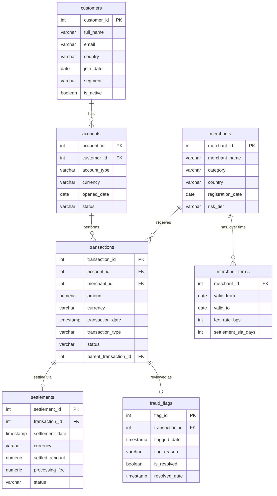

<div align="center">

# The Settlement Gap

*A SQL reconciliation investigation, built on a synthetic payments dataset, that hands off to a live operational workbench doing the same tracing in real time.*

<br/>

[](https://python.org)
[](https://postgresql.org)
[](https://duckdb.org)
[](https://nextjs.org)
[](https://abinashprasana-payments-analytics-dashboardapp-mrsz1m.streamlit.app/)
[](.)
[](https://payments-analytics-kappa.vercel.app/)
[](https://abinashprasana-payments-analytics-dashboardapp-mrsz1m.streamlit.app/?view=close&scenario=normal)


<br/>

*All three are free. The workbench and the MCP endpoint sleep when idle on their free tiers, so give them a few seconds to wake.*

</div>

---

## 🧾 What this is

- 💸 **The problem:** a purchase marked complete can still fail the daily close, because the settlement money is late, missing, or carries the wrong fee.
- 🎯 **Who it's for:** the settlement operations analyst who has to sign off that close.
- 👀 **What status reports miss:** they stop at "the customer paid." Reconciliation has to compare two separate kinds of evidence, the merchant's contract terms and the money that actually arrived.
- 🏗️ **What I built:**
  - one portable SQL model chain that defines "reconciled", checked on DuckDB and PostgreSQL on every push
  - a synthetic data generator that models incidents as events with a cause, on top of an everyday mix of exceptions, calibrated to published card payment statistics
  - a six-chapter walkthrough of one incident, from symptom to a single payment
  - a live workbench for triaging the same exceptions
  - a read-only MCP server, so Claude can ask the same questions in plain English, and an evaluation harness that measures whether a model picks the right query

Completed purchases don't always reconcile to the settlement money that eventually shows up for them. Sometimes the settlement is late. Sometimes it never arrives. Sometimes it arrives on time and for the right amount, but the fee charged against it no longer matches what the merchant's contract says it should be. This project is one investigation into that gap, built end to end on a synthetic payments snapshot: a Postgres/DuckDB-portable SQL model chain that defines what "reconciled" actually means, an authored write-up that walks through one real case of it breaking, and a Streamlit workbench that lets you triage the same exceptions the way an operations analyst would.

The rule is that SQL is the source of truth everywhere. Every join, every exception flag, every KPI is defined once in the model chain under [`sql/models`](sql/models) and executed identically on DuckDB (what the two live surfaces run) and PostgreSQL (what CI checks it against on every push). Python, the two front ends, and the MCP server only format rows that SQL already computed. No dashboard recalculates anything.

The dataset is entirely synthetic, generated with Python and Faker, and none of the four scenarios in it represents a real incident, a real merchant, or a real business outcome.

---

## 📊 Dataset snapshot

| Metric | Value |
|---|---:|
| Customers | 30,000 |
| Accounts | 36,000 |
| Merchants | 2,500, across 8 categories |
| Transactions | 600,000 |
| Eligible purchases (completed, merchant-attributed) | 456,398 |
| Settlement records | 475,162 |
| Currencies | EUR, GBP, AUD, CAD, never summed across each other |
| Transaction date range | 2023-01-01 to 2024-12-31 |
| Dataset build | `settlement-gap-v5.0.0`, generated with a fixed seed |

Four scenarios are recorded in [`data/scenarios.json`](data/scenarios.json). Three of them are incidents with a cause, applied to the merchants that cause reaches, in traffic that was generated first:

- **Settlement partner outage / GBP** (close 2024-10-10, 176 payments): a GBP settlement partner stops for three days and its merchants' payments settle three days late. 37 late on the close, across 7 categories, led by Entertainment.
- **Stale fee schedule / EUR** (close 2024-11-12, 326 payments): merchants in a 1 Oct repricing keep being charged the old fee until 19 Nov. 47 fee mismatches on the close, across all 8 categories, led by Retail.
- **Lost settlement file / CAD** (close 2024-12-03, 223 payments): one acquirer's settlement file never arrives. 46 missing on the close, across 6 categories, led by Retail.
- **Normal daily close / EUR** (2024-09-17, 281 payments): no incident. It still carries 23 everyday exceptions, spread over all six reasons and all eight categories.

No payment is moved or invented for a scenario, so each close has an ordinary day's volume and category mix. Every close also carries the everyday mix of exceptions, so an incident stands out against a normal day rather than against zero. On the fee close that mix is 8 late, 4 amount mismatches, 2 missing, 2 currency mismatches and 2 disputed payments beside the 47 fee mismatches. The site walks through the fee incident; the workbench can open all four.

### How the synthetic data was made realistic

The first version drew every value from a flat random range, and it showed. An audit of v2 found patterns no real ledger has. v3 rebuilt the generator around how card payments behave. v4 stopped planting each incident as a batch of one category on one day. v5 fixed what was still thin: a close had so few payments that small categories read "0 of 2", and apart from the incident almost nothing went wrong, so four of the six exception reasons sat at zero.

| What the audit measured | v2 | v5 (current) |
|---|---|---|
| Transactions per year | 0.3% / 6% / 94% over 2022 to 2024 | 42% / 58% over 2023 and 2024 |
| Share of all transactions in December 2024 | 36% | 7.0% |
| Purchase first digits against Benford's law (mean absolute deviation) | digits 1 to 4 at about 22% each, 5 to 9 at about 2%: fails | 0.0019 to 0.0024 in every currency: close conformity |
| Share of purchases by category | set by chance | Food & Beverage 27%, Entertainment 16%, Retail 15%, Travel 9%, Services 9%, Electronics 8%, Healthcare 8%, Utilities 8% |
| Median purchase by category | about 2,490 in every category | 17 (Entertainment) up to 109 (Electronics) |
| Share of purchases at the top tenth of merchants | 12% | 61% |
| Refunds with no earlier purchase behind them | 3,891 of 3,919 | 0 of 22,500 |
| Settlements dated on a Saturday or Sunday, outside a delay | 16,589 | 0 |
| Settlements stamped at the payment's own time of day | 61,124 of 61,124 | 0 |
| Fraud flags | the 2,500 largest transfers | risk scored: 0.6% of low-risk merchant payments, 5.8% of high-risk |
| Transactions outside the account's open period | 4,238 | 0 |
| Payments on the walkthrough's EUR close | 96 in v4 | 326 |
| Exception reasons present on the fee close | 2 of 6 in v4 | 6 of 6, on every scenario close |
| Categories with an exception on the fee close | 1 (48 of 48 in one category) | 8 of 8, from 2 (Utilities) to 17 (Retail) |

How v5 gets there:

- Purchases pick a category first, then a merchant in that category by popularity. The order of the categories and their ticket sizes follow the [UK Finance card expenditure statistics](https://www.ukfinance.org.uk/system/files/2025-11/Card%20Expenditure%20Statistics%20Dashboard%20-%202025%20Q3.pdf), where food and drink is about 38% of card transactions and entertainment, which includes restaurants and pubs, about 22%. The shares describe one acquirer's merchant book rather than national spend, with a floor of 8% so the smaller categories still show up on a single day's close.
- Amounts are lognormal per category, scaled by customer segment, with some prices snapped to .99 and .00. That spread is what makes first digits follow Benford's law.
- Volume follows each account's own activity rate, hour of day, weekday and a November and December peak. Merchant popularity follows a Pareto curve, and a customer's country decides their currency.
- Incidents are clustered anomalies with a cause. Each merchant has a settlement partner, an acquirer and a place in or out of a repricing campaign, drawn once with category weights. An incident hits whatever those merchants sold in its window, so it spreads the way its cause does. This follows how [AMLworld](https://arxiv.org/abs/2306.16424) embeds laundering patterns in a full synthetic economy, and the clustered-anomaly type in [ADBench](https://arxiv.org/abs/2206.09426).
- Every refund points to an earlier completed purchase from the same account and merchant through `parent_transaction_id`, and settles as a negative amount with no fee.
- Settlements land in a 02:00 batch on business days, inside each merchant's deadline. A payment made just before Christmas or New Year can still miss a calendar-day deadline.
- Ordinary days break too. Each completed purchase can get one everyday exception with a cause: a settlement held for a risk review (late, about 3%), a scheme or cross-border fee passed through (fee mismatch, 1.5%), a partial capture or tip adjustment (amount mismatch, 1.4%), a payout routed to the merchant's other-currency account (currency mismatch, 1.1%), a compliance hold not yet released (missing, 0.8%) and a chargeback (disputed, 0.7%). Timing, fee deductions, partial settlements and currency conversion are the usual sources of reconciliation breaks ([Optimus](https://optimus.tech/knowledge-base/payment-reconciliation), [ReconcileOS](https://reconcileos.com/blog/when-settlement-doesnt-match-practical-troubleshooting-guide)). Chargebacks are weighted by category, from restaurants at about 0.12% to travel at about 0.9% ([Chargeback.io, citing Sift](https://www.chargeback.io/blog/chargeback-statistics)). Each reason leans toward the payments where it really happens: cross-border merchants for fee and currency errors, riskier merchants for holds.
- These rates are set a little above a well-automated operation's, so that a single day shows every reason. Over the whole snapshot 9.2% of eligible payments carry an exception, incident spill-over included. A shop with good tooling would expect nearer 1 to 3%.
- Everyday exceptions are drawn per currency close by systematic sampling: each close gets its expected count of each reason, rounded up or down at random, then the payments are picked by weight. Independent coin flips left many small closes with none of a rare reason, which isn't how a steady queue looks from one day to the next.
- Closed and suspended accounts stop transacting, and failure rates rise with amount and merchant risk.

`python data/generate_data.py` prints these measurements on every run, including how each scenario close spreads across categories, and refuses to write a snapshot that misses its targets. The choices also draw on the [PaySim](https://www.msc-les.org/proceedings/emss/2016/EMSS2016_249.pdf) mobile money simulator, the [Sparkov](https://github.com/namebrandon/Sparkov_Data_Generation) card transaction generator, IBM's [synthetic credit card transactions](https://arxiv.org/abs/1910.03033), [Stripe's payout timing](https://support.stripe.com/questions/understanding-daily-automatic-and-manual-payout-schedules), published [card network dispute thresholds](https://solidgate.com/blog/monitoring-programs/), and Nigrini's mean absolute deviation bands for Benford conformity.

---

## 🗺️ What runs where

| Surface | Role | Runtime |
|---|---|---|
| 📖 The walkthrough | Authored investigation with generated SQL evidence | Static Next.js export on Vercel |
| 🧭 The workbench | Daily-close triage, exception filtering, payment trace, CSV evidence export | Streamlit Community Cloud, cached in-memory DuckDB |
| 🤖 Ask Claude (MCP) | Plain-English questions from Claude, answered through the same query registry | Read-only Streamable HTTP on Render's free tier ([`render.yaml`](render.yaml)), or local stdio; in-memory DuckDB |
| ✅ Compatibility check | Proves the SQL chain returns identical results on both engines | Ephemeral PostgreSQL, run in GitHub Actions on every push |
| 🗄️ Power BI v1 | Historical appendix: an earlier report, retired because its DAX measures don't satisfy the current metric contract | [`archive/power-bi-v1`](archive/power-bi-v1/README.md) |

The walkthrough and the workbench show the same dataset version, as-of date, and build SHA, so you can confirm they're looking at the same release. Everything runs on a free tier, and none of it needs a hosted database.

---

## 🔍 The reconciliation rule, and what it flags

A payment is considered matched when a settlement record exists, its currency matches the payment's, and `ABS(gross - settled_amount - processing_fee) <= 0.01`. Everything that isn't matched gets classified into one or more independent flags (missing, late, currency mismatch, amount mismatch, fee mismatch, disputed), and a payment can carry several of these at once. The exception queue uses a fixed precedence only to choose which one gets shown as the primary label; it doesn't hide the others.

```text
typed staging models
  -> int_expected_settlements        (population + effective merchant term)
  -> int_settlement_reconciliation   (expected vs. recorded, every flag)
     |-> mart_daily_close            (currency-specific close health)
     |-> mart_exception_queue        (operational triage queue)
     |-> mart_merchant_health        (merchant-level concentration)
     |-> mart_payment_trace          (full audit trail for one payment)
     `-> mart_category_health        (segment isolation evidence)
```

The full definitions (population, grain, currency boundaries, and query IDs) are documented in [`docs/metric_catalog.md`](docs/metric_catalog.md), and the tests check the code against it.

Two more layers sit on top of the deterministic rules, built as SQL marts rather than a separate pipeline: an isolation-forest anomaly score with SHAP attribution that flags payments unusual relative to their own merchant's history rather than a fixed threshold, and a pair of statistical screens: trailing control limits on the daily exception rate, and a Benford's-law conformity check on transaction amounts. Both are explicitly framed as proof-of-concept screens on synthetic data, not fraud findings, and neither is wired into either front end yet.

Read access to all of this goes through one gate: `AnalyticsEngine.query(query_id, params)` in [`scripts/analytics_engine.py`](scripts/analytics_engine.py), which validates every query ID and parameter against a fixed registry. The MCP server goes through the same gate. There is no arbitrary-SQL endpoint anywhere in the public surfaces.

---

## 📖 The walkthrough

Six chapters, each answering the question the last one raised:

| Chapter | What it shows |
|---|---|
| **Answer** | The stakeholder's question and the short answer, up front |
| **Contract** | The four metrics that define a clean close, with their grain, currency rule and query ID |
| **Data** | The source model, and the four scripted closes on one date axis |
| **Investigation** | Three queries (coverage, then category, then exception reason), each with its chart pinned beside the explanation, ending in one payment traced end to end |
| **Proof** | The finding, the action and its owner, the model chain, 12 of 12 quality checks, and how to reproduce it |
| **Use it** | A deep link into the workbench and the MCP endpoint, with one real `trace_payment` call replayed |

SQL, full result tables and check lists sit behind "Show" toggles, so the page reads as findings first. Every number comes from a payload generated from the SQL marts; nothing on the page is typed by hand. Motion is CSS only, with no animation library, and switches off for visitors who ask for reduced motion. Lighthouse on mobile scores 95 for performance and 100 for accessibility.

---

## 🧭 The workbench

Four views, reachable as a 90-second path or directly via URL:

| View | What it does |
|---|---|
| **Close** | KPI cards and charts for one currency's daily close: settlement coverage, exceptions, overdue value, fee delta |
| **Exceptions** | The filterable triage queue: every flagged payment, every reason it's flagged, sorted by the same precedence the SQL defines |
| **Trace** | One payment end to end: its transaction, its effective merchant term, its recorded settlement, and a plain-language explanation of exactly which SQL rule flagged it |
| **Catalog** | The metric and model reference, plus a live quality-check panel, currently 12 of 12 checks passing against the snapshot |

Every view is deep-linkable (`?view=&scenario=&payment_id=`), which is how the walkthrough hands a specific payment straight to its trace in the workbench.

---

## 🤖 Ask Claude (MCP)

The query registry is also published as a [Model Context Protocol](https://modelcontextprotocol.io) server, so you can ask Claude about the snapshot in plain English and get answers built from the same validated queries the workbench runs. It's read-only, and it has no way to run SQL you write. The walkthrough's last chapter, "Use it", replays one real call.

```text
https://settlement-gap-mcp.onrender.com/mcp
```

In Claude.ai or Claude Desktop, add that under Settings → Connectors → Add custom connector. In Claude Code:

```bash
claude mcp add --transport http settlement-gap https://settlement-gap-mcp.onrender.com/mcp
```

| Tool | What it does |
|---|---|
| `list_queries` | Lists the registered queries with their allowed and required parameters |
| `run_query` | Runs one registered query with validated parameters and returns at most 200 rows |
| `trace_payment` | Explains one payment: its expected terms, its settlement if there is one, and every reconciliation rule with whether it fired |

Ask *"why was payment 560942 flagged?"* and Claude calls `trace_payment(payment_id=560942)`, then answers from the fields that come back, along these lines:

> Payment 560942 is a CAD 906.42 Electronics purchase from the 2024-12-03 close (scenario `missing_retail_cad`). Under the merchant's terms (210 bps, 3-day SLA) it should have settled by 2024-12-06, net of a CAD 19.03 fee. No settlement exists. At the 2025-01-10 as-of date the `missing` rule fired, 35 days past the SLA. None of the other five rules applies, because there's no settlement to compare against.

How it stays safe:

- 🚪 Every tool goes through `AnalyticsEngine.query`. Unknown query IDs, unsupported parameters and extra arguments are refused before anything runs.
- 🧊 The data is the in-memory DuckDB snapshot, rebuilt on each start, so there's nothing on disk for a call to change.
- 📝 Each call, allowed or refused, leaves one JSON audit line: in `mcp_server/logs/audit.jsonl` locally, or in the service log when hosted, with a salted hash instead of the caller's address.
- 🌐 The hosted endpoint checks Host and Origin headers against DNS rebinding, caps requests at 16 KB, and allows 30 calls a minute per caller.
- 📌 One test pins every tool's name, description and schema in `mcp_server/tests/tool_manifest.json`, since that's what the model reads and what tool-poisoning attacks tamper with. Another fails if the real `trace_payment` stops matching the replay on the site.
- 🙈 `scenario_options` lists only what identifies a close. The expected outcome of each scripted incident stays out of what the model can read, so it has to query the data to answer.

It's a demo on synthetic data. There are no accounts, because there's nothing private behind it and nothing it can change. The free instance sleeps when idle, so the first call can take 30 to 60 seconds. It covers the same payments as the workbench's trace view (the four scenario closes) and leaves out `exception_scoring`, which needs the dev-only scikit-learn/SHAP stack.

<details>
<summary>Running it locally, over stdio or HTTP</summary>

<br/>

The stdio server needs no network at all. Register it with Claude Code from the repository root:

```bash
claude mcp add settlement-gap -- uv --directory ./mcp_server run settlement-gap-mcp
```

For Claude Desktop, add it to `claude_desktop_config.json` with an absolute path (on Windows, escape the backslashes, as in `D:\\path\\to\\payments-analytics\\mcp_server`):

```json
{
  "mcpServers": {
    "settlement-gap": {
      "command": "uv",
      "args": ["--directory", "/absolute/path/to/payments-analytics/mcp_server", "run", "settlement-gap-mcp"]
    }
  }
}
```

`uv run settlement-gap-mcp-http` serves the same tools over HTTP on `http://127.0.0.1:8000/mcp`, the way the hosted copy runs. The hosted copy is a free Render web service defined in [`render.yaml`](render.yaml); [`docs/deployment.md`](docs/deployment.md) covers creating it.

</details>

---

## 🧪 MCP evaluation

The MCP server already validates every call against the registry, so a request for an unknown query ID or a bad parameter is refused before it runs. What was not measured is whether a model, given a plain English question, chooses the right tool and the right parameters in the first place. This evaluation adds that: 45 questions across 7 categories, run through the real MCP tools, plus 18 refusal and prompt injection cases. It lives in [`mcp_eval/`](mcp_eval) and does not change the server or its pinned tool schemas.

| Set | Size | Categories |
|---|---:|---|
| Golden questions | 45 | payment trace (9), close KPI (8), exception queue (7), segment isolation (5), metadata (5), ambiguous (5), currency boundary (6) |
| Refusal cases | 18 | arbitrary SQL (4), unknown query ID (4), invalid parameter (4), cross currency sum (3), prompt injection (3) |

Every expected answer is derived from the snapshot by `AnalyticsEngine` and replayed in CI, so the golden files fail the build if the data drifts under them. Payment IDs, dates, and figures are real rows. `benford_conformity` and `exception_rate_screen` are served by `run_query` but were left out of the question set on purpose.

How a trial is scored: the first substantive tool call is compared with the expected tool and query ID, then its arguments are normalised the way the engine normalises them and compared key by key. Discovery calls (`list_queries`, `scenario_options`) before it are allowed. Currency boundary and refusal answers are classified deterministically, and an answer fails outright if it states the sum of amounts from two currencies. Each question runs 3 times by default; the reported outcome is the modal one, with Wilson 95% intervals, and pass^k shows how often every repeat was right.

### Status

The harness, the golden set and the refusal set are built and tested, and CI replays both through the real tools on every push. The live model run is scheduled next, on `openai/gpt-oss-120b` through Groq; its free tier allows about 200,000 tokens a day, and the questions suite alone uses about that.

A first live run on an earlier version of the data showed why the eval matters: on four questions the model answered from the scenario list's expected outcomes instead of querying anything. The server no longer serves those fields.

### Results

| Metric | Result |
|---|---|
| Tool selection accuracy | TODO |
| Parameter accuracy given the correct tool | TODO |
| End to end accuracy | TODO |
| Disagreement across repeats | TODO |
| Currency boundary questions handled | TODO |
| Refusal cases refused or safely reformulated | TODO |
| Free form text to SQL answer accuracy | TODO |
| Free form text to SQL unsafe query rate | TODO |

These cells stay TODO until two things happen: the question and refusal sets are reviewed (`"reviewed": true` in [`mcp_eval/golden`](mcp_eval/golden)), and a live run is executed with a `GROQ_API_KEY`. Reported figures use reviewed records only, and every results file says so.

The comparison path in [`mcp_eval/freeform_sql.py`](mcp_eval/freeform_sql.py) gives the same model the raw schema and the scenario manifest and asks for one DuckDB query per question. The query runs on a read only, locked copy of the same snapshot, and a deterministic check flags destructive statements, money sums without a currency boundary, and reads of customer names or emails.

### Running it

```bash
uv run --project mcp_server --with-requirements requirements-eval.txt python -m mcp_eval.run_eval --suite questions --dry-run
```

The dry run replaces the model with a scripted oracle that makes the expected calls through the real server, so it needs no key and should score 100%. CI runs it on every push. Live runs read `GROQ_API_KEY` from the environment, or from the `GROQ_API_KEY=` line in the untracked `.env` file, and never print it. They pace requests at one every 2.1 seconds, and stop cleanly at `--max-requests` (400 by default, inside one day of Groq's free tier). They are left out of CI because they need a key and are not deterministic.

```bash
uv run --project mcp_server --with-requirements requirements-eval.txt python -m mcp_eval.run_eval --suite questions
uv run --project mcp_server --with-requirements requirements-eval.txt python -m mcp_eval.run_eval --suite refusal
uv run --project mcp_server --with-requirements requirements-eval.txt python -m mcp_eval.freeform_sql --suite questions
```

### Limitations

- One person labels the golden set, so the expected calls reflect one reading of each question.
- 45 questions and 18 cases give wide intervals; a few flipped outcomes move the headline rate by several points.
- Results depend on one model, one provider, and the date of the run.
- The free form comparison runs read only against a snapshot copy. It says nothing about what the same SQL would do against a writable database.
- Tool results longer than 8,000 characters are truncated before the model sees them, to fit the free tier's token limits.

---

## 🗂️ Schema


```mermaid
erDiagram
    customers ||--o{ accounts : "has"
    accounts ||--o{ transactions : "performs"
    merchants ||--o{ transactions : "receives"
    merchants ||--o{ merchant_terms : "has, over time"
    transactions ||--o| settlements : "settled via"
    transactions ||--o| fraud_flags : "reviewed as"

    customers {
        int customer_id PK
        varchar full_name
        varchar email
        varchar country
        date join_date
        varchar segment
        boolean is_active
    }

    accounts {
        int account_id PK
        int customer_id FK
        varchar account_type
        varchar currency
        date opened_date
        varchar status
    }

    merchants {
        int merchant_id PK
        varchar merchant_name
        varchar category
        varchar country
        date registration_date
        varchar risk_tier
    }

    merchant_terms {
        int merchant_id FK
        date valid_from
        date valid_to
        int fee_rate_bps
        int settlement_sla_days
    }

    transactions {
        int transaction_id PK
        int account_id FK
        int merchant_id FK
        numeric amount
        varchar currency
        timestamp transaction_date
        varchar transaction_type
        varchar status
        int parent_transaction_id FK
    }

    settlements {
        int settlement_id PK
        int transaction_id FK
        timestamp settlement_date
        varchar currency
        numeric settled_amount
        numeric processing_fee
        varchar status
    }

    fraud_flags {
        int flag_id PK
        int transaction_id FK
        timestamp flagged_date
        varchar flag_reason
        boolean is_resolved
        timestamp resolved_date
    }
```

`merchant_terms` is effective-dated: a merchant's fee rate and settlement SLA can change over time, and every payment resolves against whichever term row was in force on its transaction date. That join is where most of the interesting reconciliation logic actually lives.

<details>
<summary>Constraints worth knowing about</summary>

<br/>

**`transactions`**: `amount` must be positive. `transaction_type` is `purchase`, `refund`, or `transfer`; a `transfer` is never merchant-attributed, and a `purchase`/`refund` always is. `status` is `completed`, `pending`, or `failed`; only completed, merchant-attributed purchases enter the reconciliation population. `parent_transaction_id` is set exactly when the row is a refund, and points to the earlier completed purchase it reverses.

**`merchant_terms`**: primary key is `(merchant_id, valid_from)`. `valid_to` is nullable, meaning the term is still open-ended.

**`settlements`**: `transaction_id` is unique, so a completed purchase or refund has at most one settlement record. `processing_fee` is non-negative. `settled_amount` is negative for a refund, which is debited from the merchant's payout.

**`fraud_flags`**: `resolved_date` must be null unless `is_resolved` is true, and set to a date on or after `flagged_date` when it is.

</details>

---

## 📁 Project structure

```text
payments-analytics/
│
├── data/
│   ├── generate_data.py          # deterministic snapshot; incidents applied as events
│   ├── scenarios.json            # the four scenarios and the incident behind each
│   └── raw/                      # the seven source CSVs
│
├── schema/
│   ├── create_tables.sql
│   └── indexes.sql
│
├── sql/models/                   # staging -> intermediate -> mart, the analytical core
│
├── scripts/
│   ├── analytics_engine.py       # the query registry both front ends read through
│   ├── anomaly_scoring.py        # isolation forest + SHAP, dev-only dependency
│   ├── generate_artifacts.py     # builds the walkthrough's data payload
│   ├── check_sql_parity.py       # DuckDB vs. PostgreSQL, run in CI
│   └── load_data.py
│
├── dashboard/
│   ├── app.py                    # the four-view Settlement Operations Workbench
│   └── workbench_ui.py
│
├── site/                         # the Next.js walkthrough, static export
│
├── mcp_server/                   # read-only MCP server, managed with uv
│   ├── settlement_gap_mcp/       # the three tools, audit log, HTTP transport
│   └── tests/                    # tool refusals, HTTP hardening, pinned tool definitions
│
├── mcp_eval/                     # natural language evaluation of the MCP tools
│   ├── golden/                   # 45 questions and 18 refusal cases, answers derived from the snapshot
│   ├── run_eval.py               # drives a model through the real MCP tools and scores it
│   ├── freeform_sql.py           # the raw text-to-SQL comparison path
│   └── results/                  # aggregate results from live runs
│
├── render.yaml                   # free Render service for the public MCP endpoint
│
├── tests/                        # generator, SQL, parity, engine, and UI contracts
│
├── docs/
│   ├── metric_catalog.md         # the actual metric and query-ID contract
│   ├── deployment.md
│   └── acceptance.md
│
└── archive/                      # retired v1 dashboard, SQL, and Power BI report
```

---

## 🚀 Run locally

**Prerequisites:** Python 3.12, Node.js 24. PostgreSQL 15+ only if you're running the parity check.

```bash
python -m venv .venv

# Windows
.venv\Scripts\Activate.ps1

# macOS / Linux
source .venv/bin/activate

python -m pip install -r requirements-dev.txt
python scripts/generate_artifacts.py --check
streamlit run dashboard/app.py
```

Run the Python test suite:

```bash
python -m unittest discover -s tests -p "test_*.py" -v
```

The MCP server has its own environment and tests (needs [uv](https://docs.astral.sh/uv/)):

```bash
cd mcp_server
uv sync
uv run pytest
```

With local PostgreSQL credentials in `.env`, check that both engines agree:

```bash
python scripts/check_sql_parity.py
```

Build the static walkthrough:

```bash
cd site
npm ci
npm run lint
npm run typecheck
npm run build
```

To run against the production-shaped PostgreSQL database instead of the CSV snapshot, copy `.env.example` to `.env`, create the schema from [`schema/create_tables.sql`](schema/create_tables.sql), and run `python scripts/load_data.py`. It validates the snapshot and loads all seven tables in one transaction.

See [`docs/acceptance.md`](docs/acceptance.md) for the full release checklist. Publishing is a deliberate, owner-approved step: moving a local branch never touches either live URL by itself.

---

## 🛡️ Guardrails

- The four scenarios demonstrate reconciliation technique. They are not real incidents and don't support a causal business claim.
- Exception flags are operational evidence, not a fraud or compliance determination.
- Anomaly scores and statistical screens rank how unusual something looks against this synthetic snapshot — they carry no detection-rate claim and no fraud finding.
- Workbench notes and review status live only in the browser session and never write back to the snapshot.
- The MCP server can only run queries that already exist in the registry. Its answers explain the synthetic snapshot; they aren't a production integration.
- Every public money value carries its own currency; nothing is ever summed across EUR, GBP, AUD, and CAD.
- The v1 Power BI report is archived, not deleted — it's kept as a historical appendix because its own DAX measures predate and don't satisfy the current metric contract.

---

## 👋 Author

**Abinash Prasana Selvanathan**
